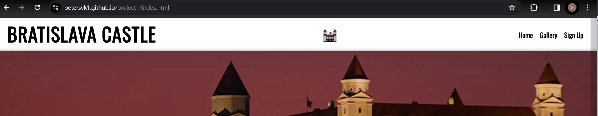
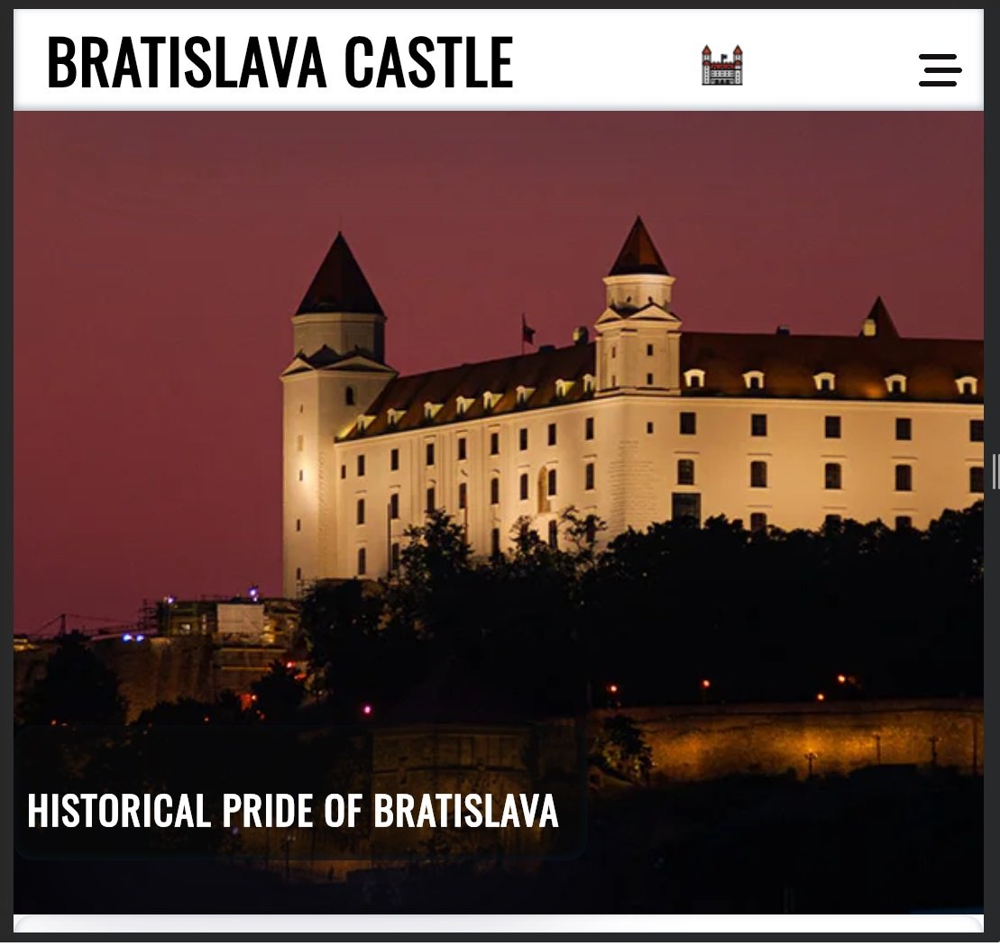
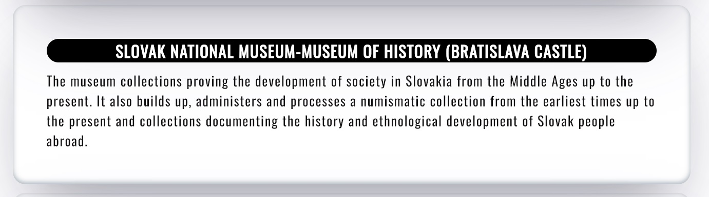
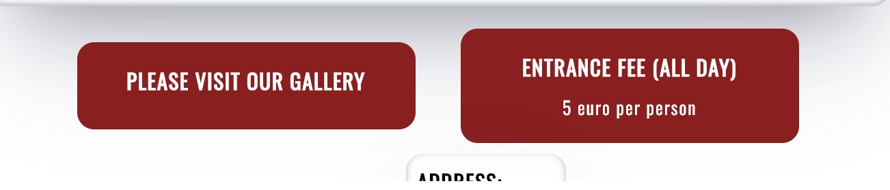
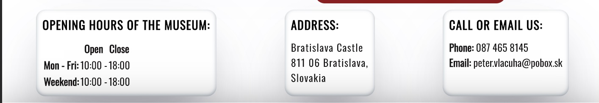
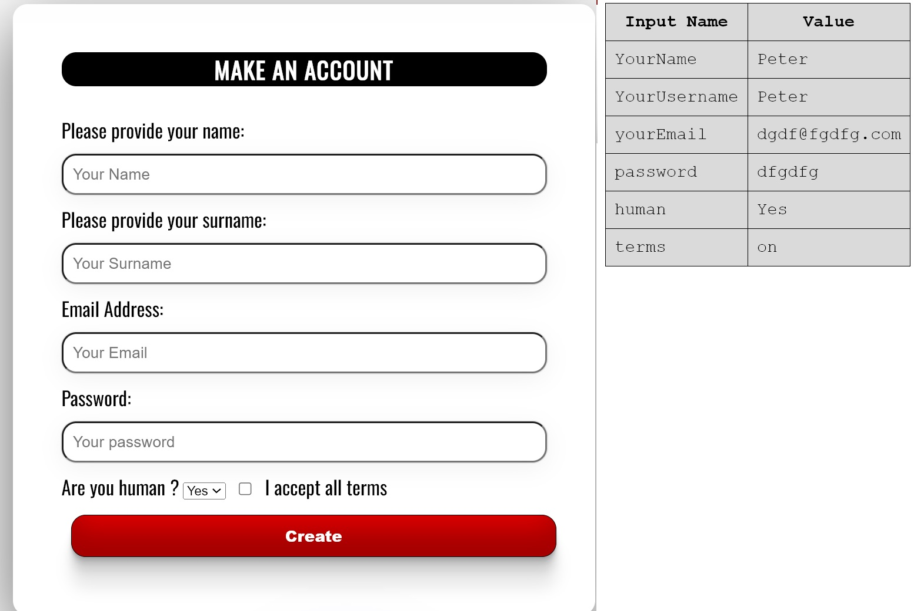
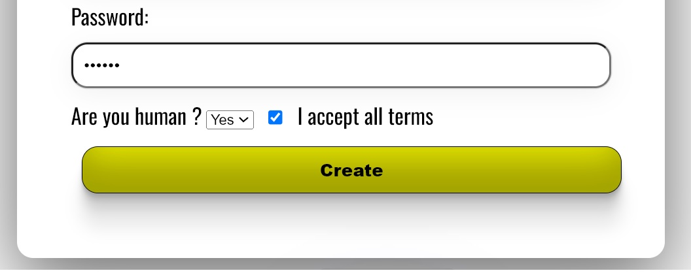

 Project name : Bratislava Castle

# Bratislava Castle
Bratislava Castle website is website about brief history of the oldest castle in Slovakia.
Visitors of the website will be able to find information about castle and museum which is located inside.
Users can find map with castle, contact informations,sign up form,pictures,price per day.
Website is for people who like history.

-------------

# Features:

## Navigation bar:
1. --Website contains navigation bar: Home,Gallery,Sign up.
2. --When you click Bratislava castle it will always go back to home page.
3. --There is also small castle picture which has same function - return to home page.
4. --Navigation clearly tells user what to expect when they click on it.

-------------
## The Header:
1. --Shows name of the castle using black and white colors
2. --Header explains its about bratislava castle.

-------------

## Text section:
1. --Tells user little bit of history about Bratislava castle.
2. --Its easy to read and has enough information about castle.

-------------

## Gallery button under text:
1. --When user click on it it will take him to page with all pictures
2. --Next to it user can see how much entrance cost

--------------

## Information section:
1. --Here user can find informations such as address, phone number, openning hours.
2. --Its seperated from each other and easy to read.

--------------

## Sign Up page:
1. -- Here user can sign up and it will collect data and show them on new page if its successful. Used this https://formdump.codeinstitute.net to check if its working.
2. -- Sign Up button will change collor whenm user hover over it from red to yellow.

