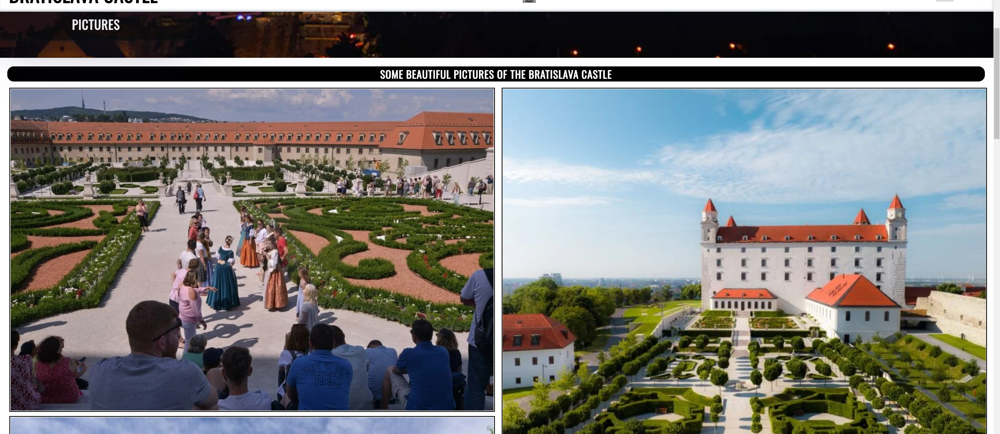
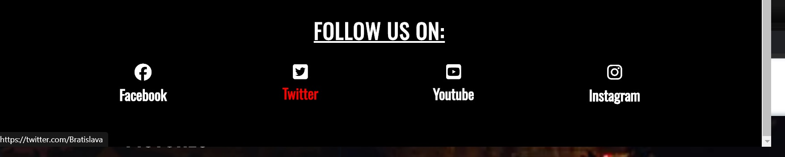
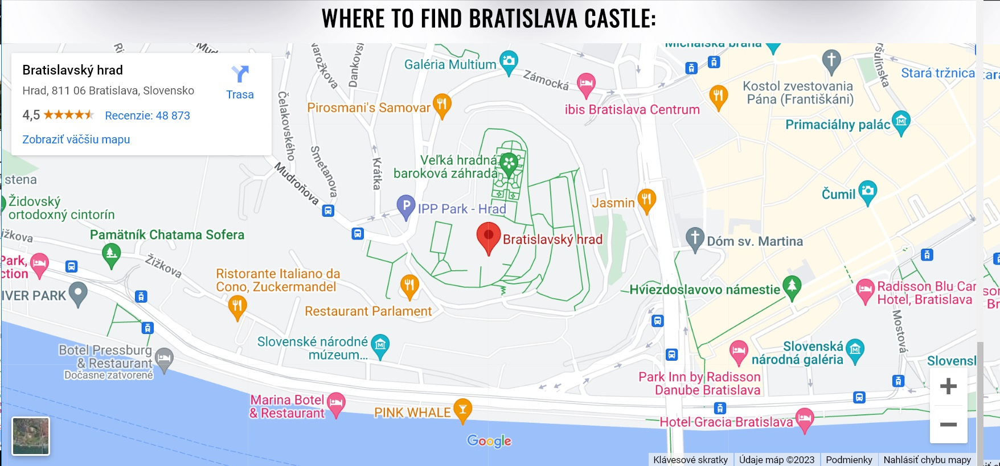
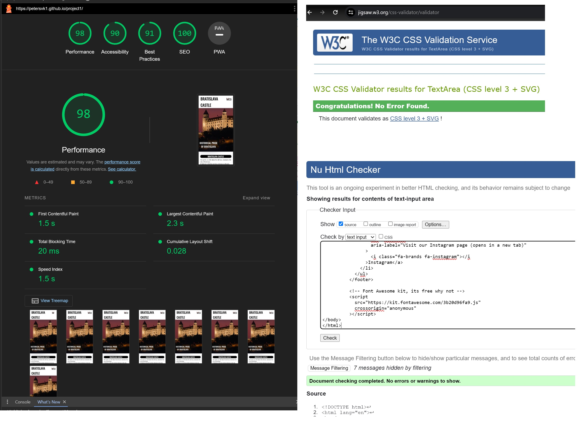

 Project name : Bratislava Castle

#  Project name : Bratislava Castle
Bratislava Castle website is website about brief history of the oldest castle in Slovakia.
Visitors of the website will be able to find information about castle and museum which is located inside.
Users can find map with castle, contact informations,sign up form,pictures,price per day.
Website is for people who like history.

-------------

## Features:

### Navigation bar:
- Website contains navigation bar: Home,Gallery,Sign up.
- When you click Bratislava castle it will always go back to home page.
- There is also small castle picture which has same function - return to home page.
- Navigation clearly tells user what to expect when they click on it.

-------------
### The Header:
- Shows name of the castle using black and white colors
- Header explains its about bratislava castle.

-------------

### Text section:
- Tells user little bit of history about Bratislava castle.
- Its easy to read and has enough information about castle.

-------------

### Gallery button under text:
- When user click on it it will take him to page with all pictures
- Next to it user can see how much entrance cost

--------------

### Information section:
- Here user can find informations such as address, phone number, openning hours.
- Its seperated from each other and easy to read.

--------------

### Sign Up page:
- Here user can sign up and it will collect data and show them on new page if its successful. Used this https://formdump.codeinstitute.net to check if its working.
- Sign Up button will change collor whenm user hover over it from red to yellow.

---------------

### Gallery page:
- Here user can find beautiful pics of Bratislava castle.
- They will have idea how castle look.

----------------

### Footer section:
- Here user can click on social media icons and it will take them to facebook,youtube,instagram,twitter.
- Names of social media will change from white to red when user hover their mouse over.
- It makes very easy to find social media for user

-----------------
### map section:
- Its important for user to know where Castle is located
- User can easier find transport and reach their destination with map.

-----------------

### Testing:
- I tested that website works on different browsers: chrome,brave,edge.
- Project is responsive,looks good on phone and also other standart devices.
- I used devtools build in chrome but also my phone.

### Bugs:
Didnt encounter any, atleast not on phone or chrome browser PC.

### Validator testing:
- HTML -- No error were returned when passing through W3C validator
- CSS -- No errors were found using Jigsaw validator
- Accessibility -- I confirmned colors and fonts are easy to read and it passed lighthouse in devtools

# Deployment:
- This site is deployed to github pages.
- Here are steps: In the gihub repository, go to the settings tab. There on the left side find pages and click on it. Then in pages tab click on branch and select main. Then wait till link to your website is generated.

- Here is link for live version: https://petersvk1.github.io/project1/index.html

# Credits:

## Content:
- The code to make a header and navigation bar was inspired by Love running project which was as an example project.
- Text about history of the Bratislava Castle was taken from https://www.visitbratislava.com/places/bratislava-castle/
- Many ideas were inspired by this website https://www.w3schools.com/html/default.asp  and https://www.w3schools.com/css/
- I used this https://formdump.codeinstitute.net/ in my sign up form to see if data are sent corectly

## Media